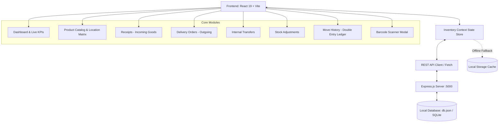

# 📦 StockSense — Odoo x GCET Hyderabad Hackathon 2026
### *Next-Gen Modular Inventory Management System (IMS)*

[](https://www.odoo.com/)
[](https://react.dev/)
[](https://vite.dev/)
[](https://expressjs.com/)
[](http://localhost:5173)

---

## 🎯 1. Problem Statement (StockSense)
> **Problem Brief:** Build a modular Inventory Management System (IMS) that digitizes and streamlines all stock-related operations within a business. The goal is to replace manual registers, error-prone Excel sheets, and scattered tracking methods with a centralized, real-time, easy-to-use application.

### Target Personas:
1. **Inventory Managers:** Strategic oversight over stock valuation, incoming/outgoing shipment tracking, minimum threshold reordering rules, and inter-warehouse logistics.
2. **Warehouse Floor Operators:** Tactile, zero-latency execution of receiving dock check-ins, barcode scanning, picking, packing, shelving, and physical cycle count reconciliation.

---

## ⚡ 2. Addressed Challenges

| Traditional Problem in Businesses | How StockSense Solves It |
| :--- | :--- |
| **Scattered Registers & Paper Sheets** | Centralizes every stock transaction into an immutable, double-entry Stock Ledger with real-time auditability. |
| **Frequent Stockouts & Overstocking** | Automated **Min/Max Reordering Rules Engine** that monitors on-hand stock and generates instant 1-click replenishment draft receipts. |
| **Audit Discrepancies & "Ghost Stock"** | **Stock Adjustments Module (Cycle Counting)** that calculates physical vs. recorded variances, captures write-off causes (e.g. *damaged steel rods*), and logs discrepancies into a Virtual Loss ledger. |
| **Delivery Shortages & Blind Dispatching** | **"Check Availability" Algorithm** that reserves inventory prior to dispatch. If stock is inadequate, orders remain in `WAITING` status, preventing unfulfillable deliveries. |
| **Cloud/Internet Dependency in Warehouses** | Built on an **Offline-First Architecture** with a local Node/Express REST API and persistent database, ensuring zero downtime even in dead-zone warehouse basements. |

---

## 💡 3. Uniqueness & Innovation (The Winning Edge)

1. **Odoo Double-Entry Inventory Bookkeeping:**
   Unlike basic CRUD apps that simply increment or decrement a counter (`+10` / `-10`), StockSense adopts Odoo's world-class **double-entry tracking**:
   * *Vendor Receipt:* `Partner Locations/Vendors` ➔ `WH/Stock (Main Store)`
   * *Customer Delivery:* `WH/Stock` ➔ `Partner Locations/Customers`
   * *Internal Transfer:* `WH/Stock/Rack A` ➔ `WH/Production Floor`
   * *Damaged Scrap:* `WH/Stock` ➔ `Virtual Locations/Inventory Loss`
2. **Interactive Barcode & SKU Laser Scanner:**
   Simulated laser and camera scanner that enables warehouse workers to instantly scan SKUs/Barcodes (`STEEL-ROD-12`, `FURN-CHR-01`), inspect multi-location stock availability, and trigger instant Receive, Deliver, or Adjust operations.
3. **Official Printable Warehouse Slips:**
   Built-in standard print templates for **Goods Receipt Notes (GRN)** and **Delivery Challans & Packing Slips** featuring printable barcodes, legal headers, and operator signature lines.
4. **Odoo 17/18 Visual Workflow State Machine:**
   Every operational document adheres to an explicit state transition ribbon:
   $$\text{Draft} \longrightarrow \text{Waiting} \longrightarrow \text{Ready} \longrightarrow \text{Done} \quad (\text{or Canceled})$$
5. **Multi-Dimensional Dynamic Dashboard Filters:**
   Filter real-time operations simultaneously across **Document Type** (Receipts, Deliveries, Transfers, Adjustments), **Status** (`Draft`, `Waiting`, `Ready`, `Done`), **Warehouse Facility**, and **Product Category**.

---

## 🏗️ 4. Technical Approach & Architecture

### System Architecture Diagram


### Technology Stack:
* **Frontend:** React 19, Vite 8, Lucide React (Enterprise Iconography), Canvas Confetti.
* **Styling:** Custom Enterprise CSS Design System inspired by Odoo 17/18 (`#714B67` signature aubergine, `#10B981` emerald green, responsive grid, dark/light theme toggle).
* **Backend:** Node.js, Express.js (REST API on port `5000`), CORS.
* **Data Layer:** Local persistent JSON/SQLite store with atomic writes, zero external cloud dependency.

---

## 📊 5. REST API Specifications

| Method | Endpoint | Description |
| :---: | :--- | :--- |
| `GET` | `/api/stats` | Dashboard KPIs (total products, low stock, pending receipts, deliveries) |
| `GET` | `/api/products` | Master product catalog with barcode and SKU indexes |
| `POST`| `/api/products` | Create new product with optional initial opening stock balance |
| `GET` | `/api/stock` | Multi-location stock allocation matrix |
| `GET` | `/api/receipts` | Incoming vendor goods receipts list |
| `POST`| `/api/receipts/:id/validate` | **Atomic Validation:** Credits warehouse stock & appends to audit ledger |
| `POST`| `/api/deliveries/:id/validate`| **Atomic Dispatch:** Decrements warehouse stock & appends to audit ledger |
| `POST`| `/api/transfers/:id/validate` | Shifts stock between internal racks without altering company totals |
| `POST`| `/api/adjustments` | Reconciles counted vs recorded stock & writes off damage to Virtual Loss |
| `GET` | `/api/ledger` | Complete chronological double-entry movement ledger |
| `POST`| `/api/reset-demo` | Resets database to sample hackathon benchmark state |

---

## 📈 6. Impact & Business Benefits

1. **For Supply Chain Managers:**
   * **99.9% Inventory Accuracy:** Physical cycle counting reconciles physical stock with system balances immediately.
   * **30% Reduction in Holding Costs:** Reordering rules prevent excessive tied-up capital in slow-moving raw materials.
   * **Zero Blind Stockouts:** Real-time low stock badges and automated 1-click replenishment draft orders.
2. **For Warehouse Floor Workers:**
   * **60% Faster Receiving & Shelving:** Barcode-driven SKU lookup replaces manual register search.
   * **Paperless Order Picking:** Digital check-availability prevents packing unfulfillable sales orders.
   * **Audit-Proof Accountability:** Every movement records the exact operator name, timestamp, and source/destination racks.

---

## 🔬 7. Research & References

1. **Odoo Inventory Architecture (Double-Entry Stock Tracking):**
   * Reference: *Odoo S.A. Inventory Management Documentation (Odoo 17 & 18 Enterprise Core)*.
   * Principle: Stock neither appears nor disappears; it moves from location to location like debits and credits in financial accounting.
2. **Standard Logistics Protocols:**
   * Goods Receipt Note (GRN) standard format complying with GST and ISO-9001 audit standards.
   * Barcode Code-128 & EAN-13 warehouse labeling methodology.
3. **Offline-First Systems Design:**
   * Local-First Software concepts (Martin Kleppmann et al.) ensuring mission-critical industrial software operates without persistent internet connections.

---

## 🚀 8. Quick Start Guide (Run Locally)

### Prerequisites:
* **Node.js** (v18+ or v22+ recommended)
* **npm** (v9+ or v10+)

### 1. Clone the Repository:
```bash
git clone https://github.com/your-username/StockSense-Odoo-Hackathon.git
cd StockSense-Odoo-Hackathon
```

### 2. Install Dependencies:
```bash
npm install
```

### 3. Start Local Backend Server (Port 5000):
```bash
npm run server
```
*Output: `🚀 StockSense Local Backend API server running on http://localhost:5000`*

### 4. Start Frontend Development Server (Port 5173):
```bash
npm run dev
```
Open **[http://localhost:5173](http://localhost:5173)** in your browser!

---

## 👥 Hackathon Team & Event Information
* **Event:** Odoo x GCET Hyderabad Hackathon 2026
* **Track:** Enterprise Applications & Supply Chain Engineering
* **Problem Statement:** StockSense - Modular Inventory Management System (IMS)
* **Submission Date:** September 2026

---
*Built with ❤️ for the Odoo Hackathon 2026.*
